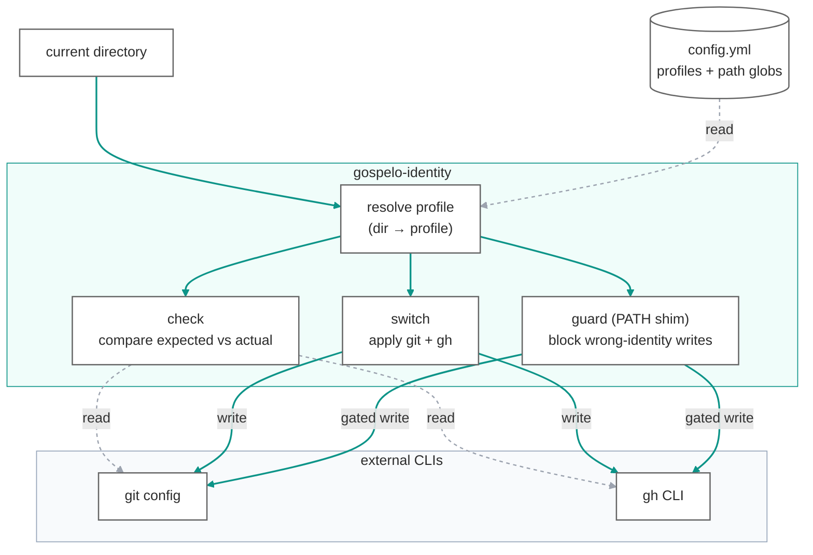

[日本語版](README_ja.md)

# gospelo-identity — Directory-Aware git/gh CLI Identity Guard

[](https://github.com/gospelo-dev/identity/blob/main/LICENSE.md)
[](https://www.python.org/)
[](https://cli.github.com/)
[](#why-gospelo-identity)

A small CLI that prevents `git` / `gh` account mix-ups when you maintain multiple GitHub profiles (personal OSS, employer, client). It maps the **current working directory** to an expected profile and verifies that local `git config` and the active `gh` CLI account match — and switches them if they do not.

## Why gospelo-identity?

If you contribute to OSS as `you@example.com` from `~/projects/oss/**` and to your employer as `you@company.com` from `~/projects/work/**`, a single forgotten `gh auth switch` can leak the wrong commit author or release into the wrong organisation. gospelo-identity:

- **Declares intent up front** in `~/.config/gospelo-identity/config.yml` — one entry per profile, with directory globs
- **Detects mismatches** before you commit or release (`gospelo-identity check`)
- **Switches both at once** — local `git config user.name`/`user.email` *and* `gh auth switch -u <account>` (`gospelo-identity switch <profile>`)
- **No fallbacks**: if there is no config file or the directory does not match any profile, you get a clear error — not a silent default

## How it works

The current working directory resolves to a profile (via path globs in your config). From that one decision, three operations act on your `git` and `gh` identity: `check` reads and compares, `switch` applies, and the optional `guard` shim blocks wrong-identity writes.



Dashed arrows are read-only (config load, `check`'s comparison); solid arrows write or gate writes.

## Installation

```bash
pip install gospelo-identity
```

Requires Python 3.11+. The `git` and [`gh` CLI](https://cli.github.com/) binaries must be available on `PATH`.

## Quick Start

```bash
# 1. Create the config interactively
gospelo-identity init

# 2. Verify the current directory matches the expected profile
gospelo-identity check

# 3. Switch git + gh to the profile that matches the current directory
gospelo-identity switch oss

# 4. Show profiles
gospelo-identity list
```

Optional: surface the active profile in your shell prompt:

```bash
PS1='$(gospelo-identity prompt --format=ps1 --show-mismatch) \w \$ '
```

## CLI Commands

| Command | Description |
|---------|-------------|
| `init` | Interactively scaffold `~/.config/gospelo-identity/config.yml` |
| `list` | List registered profiles in a table |
| `detect` | Print the profile name matched by the current directory |
| `check` | Compare expected vs actual `git config` and `gh` CLI account |
| `switch <profile>` | Apply git config + `gh auth switch` for the profile |
| `prompt` | Shell-prompt helper (`--format=ps1` / `plain` / `color`) |
| `install-guard` / `uninstall-guard` | Shadow `gh`/`git` on `PATH` to block wrong-identity writes |
| `install-commit-hook` / `uninstall-commit-hook` | Global `commit-msg` hook that strips `Co-Authored-By` |

See the [CLI Reference](https://github.com/gospelo-dev/identity/blob/main/docs/manual/en/cli-reference.md) for full options and exit codes.

## Configuration

Example configs are available in [examples/](examples/):

- `config.yml` — basic 2-profile setup with comments
- `config.minimal.yml` — 1-profile minimal example
- `config.advanced.yml` — 3+ profile setup for freelancers / multi-client work

To create your config:

```bash
# Interactive setup
gospelo-identity init

# Copy bundled template + open in $EDITOR (default: vi)
gospelo-identity init --from-template

# Print bundled template to stdout (for piping)
gospelo-identity init --show-example > ~/.config/gospelo-identity/config.yml
```

`~/.config/gospelo-identity/config.yml`:

```yaml
version: "1"

profiles:
  oss:
    description: "Personal OSS work"
    git:
      user.name: your-oss-login
      user.email: you@example.com
    gh:
      account: your-oss-login
    paths:
      - ~/projects/gospelo-dev/**
      - ~/projects/personal/**

  work:
    description: "Company work"
    git:
      user.name: your-oss-login
      user.email: you@company.com
    gh:
      account: your-work-login
    paths:
      - ~/projects/work/**

# Used only when no profile path matches the current directory (optional)
default_profile: oss
```

`paths` are glob patterns. `~` is expanded, and `**` matches any number of intermediate directories. The longest matching prefix wins when multiple profiles match.

## Enforcement (optional)

`check` / `switch` are advisory. To actively *block* wrong-identity writes — useful during automation or autonomous agent runs — install the guard:

```bash
# Shadow `gh` (add `git` with --tools gh,git) with a PATH shim that runs the
# identity check before every write (gh release/pr/repo create, git push, ...).
gospelo-identity install-guard --tools gh
export PATH="$HOME/.gospelo-identity/bin:$PATH"   # add to ~/.zshrc / ~/.bashrc
```

Now a `gh release create` / `git push` under a matched profile with the wrong active account is **blocked** (exit 1, real binary never runs); read-only commands pass through untouched. Outside any profile, or with no config, the real command always runs — the guard never breaks unrelated work. Per-write status is printed to stderr (silence with `GOSPELO_IDENTITY_QUIET=1`; bypass once with `GOSPELO_IDENTITY_SKIP=1`).

> A PATH shim only catches **name-based** calls; `/usr/bin/git push` bypasses it. It stops *accidental* wrong-identity writes, not an adversarial process — layer an OS sandbox for that.

Separately, strip `Co-Authored-By` trailers from every commit message via a global `commit-msg` hook (it chains to your existing repo hooks):

```bash
gospelo-identity install-commit-hook
```

See the [CLI Reference](https://github.com/gospelo-dev/identity/blob/main/docs/manual/en/cli-reference.md#enforcement-guard-ghgit-path-shim) for details and `uninstall-*` commands.

## Troubleshooting

### `switch` says OK, but pushes/releases still go to the wrong account (stale keyring credential)

**Symptom.** `gospelo-identity switch <profile>` (or `gh auth switch`) reports success and `gh auth status` shows the expected account as *active*, yet `git push` / `gh release` / `gh pr` act as a **different** account.

**Root cause.** `gh` stores each account's token in the OS keyring. The credential saved under one account name can become **stale or cross-wired** to another account's token (e.g. after re-running `gh auth login` across multiple profiles). `gh auth switch` only flips the *active label* in `~/.config/gh/hosts.yml`; it does not re-validate the token. So the active account says `you-personal` while the token still authenticates as `you-work`.

**Why labels lie.** The authoritative identity is **`gh api user`** (the account the token actually belongs to), *not* the active label printed by `gh auth status`.

**Detection (built in).** `gospelo-identity check` already resolves the real identity via `gh api user`, and `gospelo-identity switch` now **verifies the switch took effect at the token level** — if the active token authenticates as someone other than the target after switching, it reports `NG ... keyring mismatch` and exits non-zero instead of falsely claiming success.

**Fix (re-login the affected account):**

```bash
gh auth logout --hostname github.com --user <account>
gh auth login  --hostname github.com          # authenticate as <account> (browser)
gospelo-identity check                         # [gh CLI] should now be OK
gh api user --jq .login                        # confirms the real identity
```

### `no profile matched`

The current directory is outside every profile's `paths` and no `default_profile` is set. Add a matching glob or a `default_profile` to your config.

## Exit Codes

| Code | Meaning |
|---|---|
| `0` | Success / match |
| `1` | Expected condition not met (mismatch / no profile matched / not found) |
| `2` | Tool error (config missing, invalid YAML, external tool failure) |

## Documentation

- [Quick Start](https://github.com/gospelo-dev/identity/blob/main/docs/manual/en/quick-start.md)
- [CLI Reference](https://github.com/gospelo-dev/identity/blob/main/docs/manual/en/cli-reference.md)
- [Config Format](https://github.com/gospelo-dev/identity/blob/main/docs/manual/en/config-format.md)
- [Shell Integration](https://github.com/gospelo-dev/identity/blob/main/docs/manual/en/shell-integration.md)

Japanese documentation is available under `docs/manual/ja/` (see [README_ja.md](README_ja.md)).

## Agent Skills

Auto-protective skills for AI coding agents that run `gospelo-identity check`
**before** any write-to-remote operation (push / PR / release / package
publish) and stop the operation on mismatch. See
[`skills/README.md`](skills/README.md) for an overview.

- [Claude Code skill](skills/claude/) — drop into `.claude/skills/gospelo-identity-check/`
- [GitHub Copilot skill](skills/copilot/) — drop into `.github/copilot/skills/gospelo-identity-check/` (path subject to change as Copilot's skill spec evolves)

## License

MIT — free for commercial use. The `config.yml` you author is yours. See [LICENSE.md](LICENSE.md) for details.
