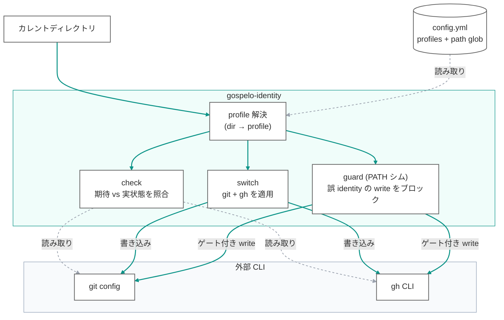

[English](README.md)

# gospelo-identity — ディレクトリ連動 git/gh CLI アイデンティティガード

[](https://github.com/gospelo-dev/identity/blob/main/LICENSE.md)
[](https://www.python.org/)
[](https://cli.github.com/)
[](#なぜ-gospelo-identity)

複数の GitHub アカウント（個人 OSS、勤務先、クライアント等）を使い分ける際に、`git` / `gh` CLI のアカウント取り違えを防ぐ小さな CLI。**現在のディレクトリ** から「期待される profile」を解決し、ローカルの `git config` と `gh` CLI のアクティブアカウントが一致しているかを検証 — ずれていれば一括で切替まで行います。

## なぜ gospelo-identity？

`~/projects/oss/**` から個人 OSS を `you@example.com` で、`~/projects/work/**` から勤務先業務を `you@company.com` でコミットしている場合、`gh auth switch` を 1 回忘れただけで誤った Author で release されたり、別組織にコミットが混入したりします。gospelo-identity は:

- **意図を明示**: `~/.config/gospelo-identity/config.yml` に profile 単位でディレクトリ glob と認証情報を宣言
- **ミスマッチを事前検知**: コミット・リリース前に `gospelo-identity check` で確認
- **同時切替**: ローカル `git config user.name` / `user.email` と `gh auth switch -u <account>` を一括で（`gospelo-identity switch <profile>`）
- **フォールバックなし**: 設定ファイル未作成や該当 profile 不在時は黙ってデフォルトを当てず、明確なエラーで停止

## 仕組み

カレントディレクトリが（config の path glob で）1 つの profile に解決されます。その 1 つの判定から、3 つの操作が `git` / `gh` の identity に作用します: `check` は読み取って照合、`switch` は適用、任意の `guard` シムは誤 identity の write をブロックします。



破線は読み取り専用（config の読み込み、`check` の照合）、実線は書き込みまたは write のゲートを表します。

## インストール

```bash
pip install gospelo-identity
```

Python 3.11+ が必要です。`git` および [`gh` CLI](https://cli.github.com/) が `PATH` 上にあること。

## クイックスタート

```bash
# 1. 対話的に config を作成
gospelo-identity init

# 2. 現在のディレクトリで期待 profile と実状態を比較
gospelo-identity check

# 3. 現在のディレクトリに合った profile に git + gh を切替
gospelo-identity switch oss

# 4. profile 一覧
gospelo-identity list
```

任意: シェルプロンプトに現在の profile を表示:

```bash
PS1='$(gospelo-identity prompt --format=ps1 --show-mismatch) \w \$ '
```

## CLI コマンド一覧

| コマンド | 説明 |
|----------|------|
| `init` | `~/.config/gospelo-identity/config.yml` を対話的に作成 |
| `list` | 登録済み profile をテーブル表示 |
| `detect` | 現在ディレクトリで適用される profile 名を出力 |
| `check` | 期待 vs 実状態（`git config` / `gh` CLI）を比較 |
| `switch <profile>` | 指定 profile の git config + `gh auth switch` を一括適用 |
| `prompt` | シェルプロンプト統合用 helper（`--format=ps1` / `plain` / `color`）|
| `install-guard` / `uninstall-guard` | `PATH` 上の `gh`/`git` をシャドウし誤 identity 書き込みをブロック |
| `install-commit-hook` / `uninstall-commit-hook` | `Co-Authored-By` を除去するグローバル `commit-msg` フック |

詳細は [CLI リファレンス](https://github.com/gospelo-dev/identity/blob/main/docs/manual/ja/cli-reference.md) を参照。

## 設定ファイル

サンプル設定は [examples/](examples/) にあります:

- `config.yml` — コメント付きの基本 2 profile 構成
- `config.minimal.yml` — 1 profile のみの最小例
- `config.advanced.yml` — フリーランス / マルチクライアント向けの 3+ profile 構成

設定ファイルの作成方法:

```bash
# 対話セットアップ
gospelo-identity init

# 同梱テンプレートをコピー + $EDITOR (既定: vi) で開く
gospelo-identity init --from-template

# 同梱テンプレートを stdout に出力 (パイプ用)
gospelo-identity init --show-example > ~/.config/gospelo-identity/config.yml
```

`~/.config/gospelo-identity/config.yml`:

```yaml
version: "1"

profiles:
  oss:
    description: "Personal OSS work"
    git:
      user.name: your-oss-login
      user.email: you@example.com
    gh:
      account: your-oss-login
    paths:
      - ~/projects/gospelo-dev/**
      - ~/projects/personal/**

  work:
    description: "Company work"
    git:
      user.name: your-oss-login
      user.email: you@company.com
    gh:
      account: your-work-login
    paths:
      - ~/projects/work/**

# どの profile の paths にも該当しない場合のフォールバック (省略可)
default_profile: oss
```

`paths` は glob パターン。`~` は展開され、`**` は任意階層にマッチします。複数 profile が同時にマッチした場合は最長一致が採用されます。

## enforcement（任意）

`check` / `switch` はあくまで助言的です。誤 identity の書き込みを実際に*ブロック*したい場合（自動化や自律エージェント実行時に有用）は guard をインストールします:

```bash
# `gh`（`git` も対象にするなら --tools gh,git）を PATH シムでシャドウし、
# 各書き込み（gh release/pr/repo create, git push ...）の前に identity チェックを実行。
gospelo-identity install-guard --tools gh
export PATH="$HOME/.gospelo-identity/bin:$PATH"   # ~/.zshrc / ~/.bashrc に追記
```

これで、マッチした profile 下でアクティブアカウントが誤っている `gh release create` / `git push` は**ブロック**されます（exit 1、本物のバイナリは実行されない）。読み取り専用コマンドはそのまま通過。どの profile にもマッチしない場所や config 不在時は本物のコマンドが必ず実行され、無関係な作業を壊しません。書き込みごとのステータスは stderr に出力されます（`GOSPELO_IDENTITY_QUIET=1` で抑制、`GOSPELO_IDENTITY_SKIP=1` で 1 回バイパス）。

> PATH シムは**名前ベース**の呼び出ししか捕捉しません（`/usr/bin/git push` はバイパス）。*うっかり*誤 identity 書き込みを止めるためのもので、敵対的プロセス対策ではありません。その用途には OS サンドボックスを併用してください。

別途、グローバル `commit-msg` フックで全コミットメッセージから `Co-Authored-By` トレーラを除去できます（既存のリポジトリフックにチェーンします）:

```bash
gospelo-identity install-commit-hook
```

詳細と `uninstall-*` コマンドは [CLI リファレンス](https://github.com/gospelo-dev/identity/blob/main/docs/manual/ja/cli-reference.md) を参照。

## トラブルシューティング

### `switch` は「OK」なのに、push/release が別アカウントになる（keyring の認証情報が古い）

**症状。** `gospelo-identity switch <profile>`（や `gh auth switch`）が成功と表示し、`gh auth status` でも期待アカウントが *active* なのに、`git push` / `gh release` / `gh pr` が**別アカウント**として動く。

**原因。** `gh` は各アカウントのトークンを OS の keyring に保存します。あるアカウント名で保存された認証情報が、別アカウントのトークンと**古いまま/混線**することがあります（複数 profile で `gh auth login` をやり直した後などに発生）。`gh auth switch` は `~/.config/gh/hosts.yml` の *active ラベル* を切り替えるだけで、トークンの再検証はしません。結果、active は `you-personal` なのにトークンの実体は `you-work`、という状態になります。

**なぜラベルは当てにならないか。** 真の identity は **`gh api user`**（トークンが実際に属するアカウント）であって、`gh auth status` が表示する active ラベルではありません。

**自動検知（実装済み）。** `gospelo-identity check` は元から `gh api user` で実 identity を解決します。さらに `gospelo-identity switch` は切替後に**トークンレベルで切替が効いたか検証**するようになりました。切替後の実トークンが目標アカウント以外を指していれば、`NG ... keyring mismatch` を出して非ゼロ終了し、**成功を誤報告しません**。

**対処（該当アカウントを再ログイン）:**

```bash
gh auth logout --hostname github.com --user <account>
gh auth login  --hostname github.com          # <account> でブラウザ認証
gospelo-identity check                         # [gh CLI] が OK になるはず
gh api user --jq .login                        # 実 identity を確認
```

### `no profile matched`

現在のディレクトリがどの profile の `paths` にも該当せず、`default_profile` も未設定。マッチする glob か `default_profile` を config に追加してください。

## 終了コード

| コード | 意味 |
|---|---|
| `0` | 成功 / 一致 |
| `1` | 期待条件未達（ミスマッチ / 該当 profile なし / 未検出 等の予期される失敗）|
| `2` | ツールエラー（config 未作成、不正な YAML、外部ツール失敗 等）|

## ドキュメント

- [クイックスタート](https://github.com/gospelo-dev/identity/blob/main/docs/manual/ja/quick-start.md)
- [CLI リファレンス](https://github.com/gospelo-dev/identity/blob/main/docs/manual/ja/cli-reference.md)
- [設定ファイル仕様](https://github.com/gospelo-dev/identity/blob/main/docs/manual/ja/config-format.md)
- [シェル統合ガイド](https://github.com/gospelo-dev/identity/blob/main/docs/manual/ja/shell-integration.md)

英語マニュアルは [`docs/manual/en/`](https://github.com/gospelo-dev/identity/tree/main/docs/manual/en) にあります（[README.md](README.md) も参照）。

## エージェントスキル

AI コーディングエージェント向けの自動保護スキル。`git push` / PR 作成 / リリース /
パッケージ公開などの **書き込み系操作の前** に `gospelo-identity check` を自動実行し、
ミスマッチ時は操作を停止します。詳細は [`skills/README.md`](skills/README.md) を参照。

- [Claude Code スキル](skills/claude/) — `.claude/skills/gospelo-identity-check/` 配下に配置
- [GitHub Copilot スキル](skills/copilot/) — `.github/copilot/skills/gospelo-identity-check/` 配下に配置（Copilot のスキル仕様により変更の可能性あり）

## ライセンス

MIT — 商用利用を含め自由に利用できます。ユーザーが作成した `config.yml` の著作権はユーザーに帰属します。詳細は [LICENSE_ja.md](LICENSE_ja.md) を参照。
